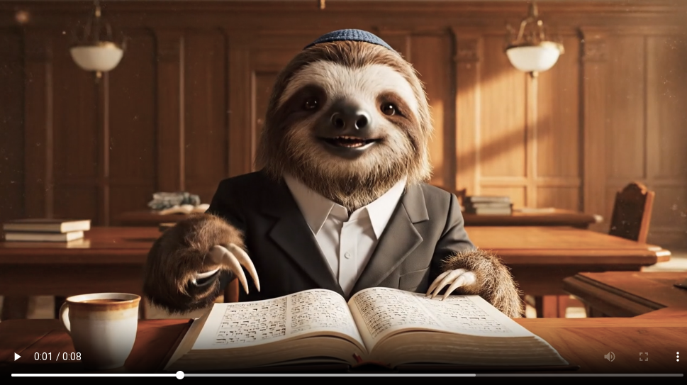

# Veo 3.1 Prompts

This repository contains a small record of various prompts and generations created with Veo 3.1. The purpose is to showcase emerging capabilities and track different prompting strategies. Some prompts are text-to-video, while others are image-to-video.

## Contents

Prompts are organized by category in subdirectories, each containing the prompt text and any associated generated video files (.mp4).

Video files are managed using Git LFS (Large File Storage).

| Prompt | Modality | Video |
|--------|----------|-------|
| [Daf Yomi Rabbi](jewish/daf-yomi-rabbi/prompt.md) | Text-to-Video | [Landscape](jewish/daf-yomi-rabbi/landscape/generation.mp4) / [Portrait](jewish/daf-yomi-rabbi/portrait/d4c3a437-ed33-4c19-92c0-01b8b159f5dc.mp4) |